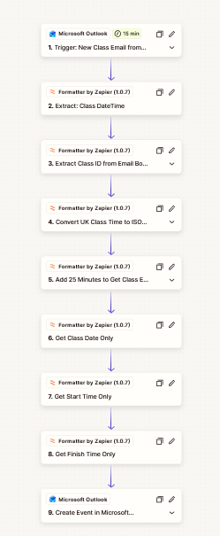
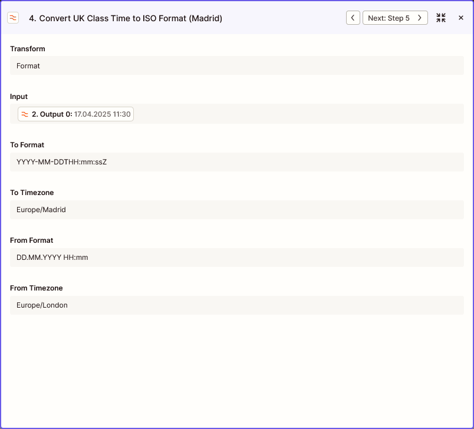
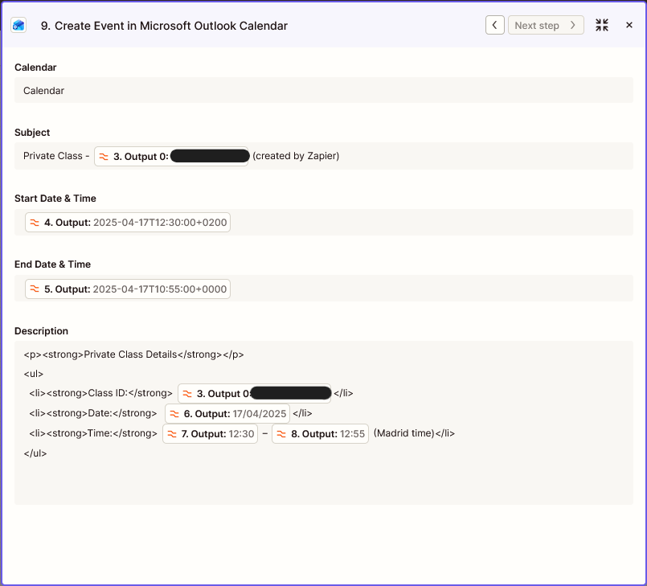

# Outlook Class Calendar Automation

A real-world workflow automation project that converted structured class-confirmation emails into Outlook calendar events.

I first built the workflow in **Zapier** to remove repetitive calendar administration. When the Zapier trial ended, I rebuilt the same core process in **Outlook VBA** so it could continue without a recurring SaaS subscription.

This repository is a **sanitised public case study**. Employer names, email addresses, class IDs, account identifiers and production messages are not included.

## The problem

I was teaching up to **40 25-minute online lessons per week** for a global online education provider.

Classes were claimed through a dynamic scheduling system. Once a class was accepted, a confirmation email arrived with a predictable structure containing the class ID and scheduled date/time.

I then had to copy those details into my main Outlook calendar manually. Each calendar entry took roughly **2–3 minutes**, so at a full timetable this could mean around **80–120 minutes of repetitive administration per week**.

Keeping the calendar accurate mattered because I planned appointments and other commitments around a teaching schedule that could change during the week.

## Version 1 — Zapier

The first working version used Microsoft Outlook and Formatter by Zapier.

The recovered production workflow contained **9 steps**:

1. Poll Outlook for a new matching class-confirmation email.
2. Extract the class date/time from the email body.
3. Extract the class ID.
4. Convert the time from `Europe/London` to `Europe/Madrid`.
5. Add 25 minutes to calculate the class end time.
6. Format the class date for the calendar description.
7. Format the start time.
8. Format the finish time.
9. Create the event in a second Outlook calendar.

```text
Teaching confirmation inbox
        |
        v
Outlook polling trigger
        |
        v
Extract date/time + class ID
        |
        v
Convert London -> Madrid
        |
        v
Calculate 25-minute end time
        |
        v
Format event details
        |
        v
Create event in main Outlook calendar
```

The Outlook trigger used a **15-minute polling interval**. The workflow removed the manual data-entry work, although it was not an instant event-driven process.

### Recovered workflow screenshots

**Full nine-step workflow**



*Sanitised view of the recovered workflow: Outlook trigger, Formatter steps and final Outlook calendar action.*

**Timezone conversion**



*The Zap converted `Europe/London` to `Europe/Madrid` explicitly rather than relying on a fixed one-hour offset.*

**Calendar event creation**



*Final Outlook action mapping the processed class data into a calendar event. Production identifiers have been removed.*

### Why Zapier worked well

- It connected two separate Outlook accounts.
- It turned a predictable email template into structured calendar data.
- It handled timezone conversion explicitly rather than relying on a hard-coded offset.
- Once configured, it ran without manual calendar entry.
- During the period I used it, I do not recall encountering missed or duplicate calendar entries from confirmation emails.

## Why I rebuilt it

The Zapier workflow solved the problem, but it depended on features that were no longer available to me once the trial ended.

For a personal operational automation, I did not consider an ongoing subscription worthwhile. Rather than return to manual calendar entry, I rebuilt the workflow using **VBA inside classic Outlook for Windows**.

The goal was not to reproduce Zapier line-for-line. It was to preserve the useful outcome using tools I already had available.

## Version 2 — Outlook VBA

The VBA version processed the same structured confirmation emails locally inside Outlook.

Its core workflow was:

```text
Class confirmation email
        |
        v
Filter matching subject
        |
        v
Extract class ID + date/time with regex
        |
        v
Adjust scheduled time
        |
        v
Check for an existing Class ID
        |
        v
Create a 25-minute Outlook appointment
        |
        v
Set 15-minute reminder
        |
        v
Move processed email to Processed folder
```

The VBA project supported three entry points:

- processing newly received matching messages while Outlook was open;
- sweeping the Inbox when Outlook started;
- a manual ribbon/toolbar action that ran the same Inbox sweep.

In day-to-day use I relied on the manual **Sweep** action as a simple way to process pending confirmations in a batch.

### Additional safeguards in the VBA version

Compared with the Zapier version, the VBA implementation added several explicit controls:

- ignored classes whose scheduled time had already passed;
- checked the calendar for the class ID before creating another event;
- moved successfully processed emails into a `Processed` folder;
- set a 15-minute calendar reminder.

## Design evolution

| Area | Zapier | Outlook VBA |
| --- | --- | --- |
| Execution | Cloud automation | Local Outlook automation |
| Trigger | 15-minute Outlook polling | New mail, Outlook startup, or manual Sweep |
| Parsing | Formatter by Zapier | `VBScript.RegExp` |
| Time handling | `Europe/London` → `Europe/Madrid` | Fixed +1 hour adjustment |
| Duration | Calculated +25 minutes | Calculated +25 minutes |
| Duplicate protection | No explicit duplicate-check step | Existing calendar searched for Class ID |
| Processed email handling | No move/archive step | Moved to `Processed` folder |
| Reminder | No explicit Zap setting recovered | 15 minutes |
| Cost model | Subscription required after trial | No additional subscription |

## A known issue in the original VBA version

The original Inbox sweep moved messages out of the Inbox while iterating through the same Outlook collection. In live use, this occasionally meant I needed to press **Sweep** a second time to catch all pending confirmations.

That behaviour is preserved here as part of the project history rather than presented as flawless. The public code will use a safer processing approach while documenting the difference from the historical implementation.

## What this project demonstrates

- workflow automation around a real operational problem;
- Microsoft Outlook integration;
- structured text extraction with regular expressions;
- date/time transformation and timezone handling;
- redesigning a working solution when cost constraints changed;
- practical safeguards such as duplicate checks and processed-item handling;
- documenting trade-offs and known limitations rather than hiding them.

## Public-repository boundaries

This repository does not include the original employer name, personal email addresses, authentication identifiers, real class IDs, production emails or raw Zapier account exports. Any example data and screenshots are sanitised or synthetic.

## Development approach

The original workflows were built with **ChatGPT-assisted development**: I defined the operational problem, desired behaviour and constraints, then used ChatGPT to help design, troubleshoot and refine the Zapier and VBA implementations.

The automation was created for my own workflow and was not deployed as an organisational system.
